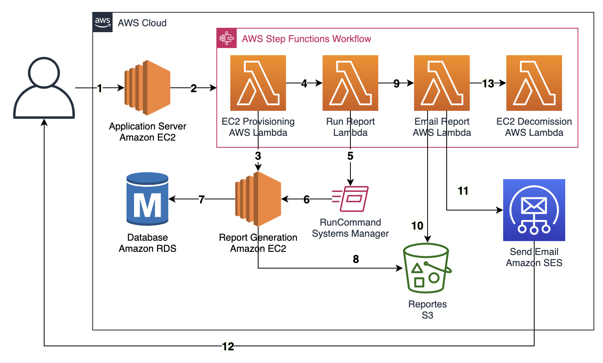
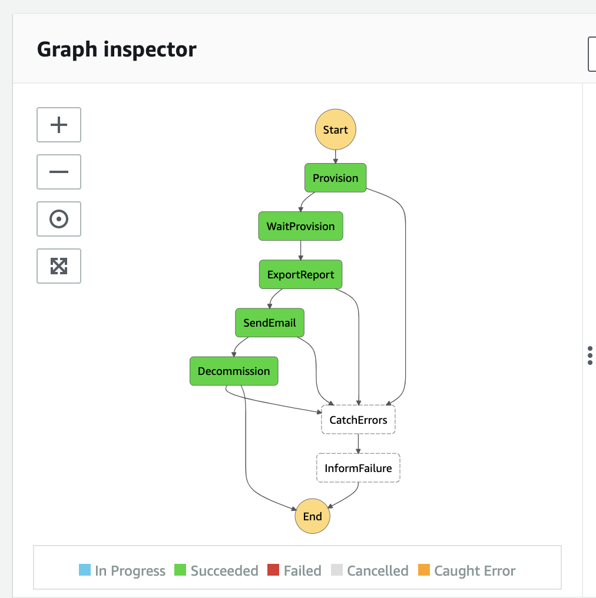

# Async Reports
Many times, companies running legacy applications on top of Amazon EC2 need to perform scheduler reports that consume application server resources and require some time to complete. To achieve this, I share a simple solution to run those reports asynchronously on a temporary Amazon EC2 instance, upload the report to an Amazon S3 bucket and finally create a pre-signed url to securely share the report via email with the people requesting it.

### Architecture


Steps: 
1. Prepare your app environment
1. Create a bucket for utility files
1. Prepare your Amazon EC2 environment
1. Create the Lambda functions
1. Setup your DB reporting scripts
1. Setup the Amazon StepFunctions Workflow
1. Test
1. Integrate into your app

### 1. Prepare your app environment
* Create a security group within your VPC for the report generation EC2 instances 
* Create an inbound rule in your database security group to allow access. 
* Enable IAM Authentication on the RDS Instance, create a user called rdsiamuser as per the [docs](https://docs.aws.amazon.com/AmazonRDS/latest/UserGuide/UsingWithRDS.IAMDBAuth.html)
* Find your DB Cluster ID using the following, replace DBClusterIdentifier
````bash
aws rds describe-db-clusters --query "DBClusters[*].[DBClusterIdentifier]"
````

### 2. Create a bucket for utility files
* Create a bucket 
* Upload [emailtemplate.html](emailtemplate.html) and replace YOUR_LOGO_URL, YOUR_APPLICATION, ANY OTHER TEXT
* Upload [runexport.sh](utility/runexport.sh)
* Upload [exportdb.php](utility/exportdb.php)
* Download RDS PEM to use TLS it from the [docs](https://docs.aws.amazon.com/AmazonRDS/latest/UserGuide/UsingWithRDS.SSL.html)
* Upload RDS PEM as rds-combined-ca-bundle.pem

### 3. Prepare your reporting environment
In or ther to provisioned EC2 instances and run commands to generate your reports, you need to perform the following:
* Setup Systems Manager in your account [docs](https://docs.aws.amazon.com/systems-manager/latest/userguide/systems-manager-setting-up.html)
* Create an AMI that has the Systems Manager Agent installed [docs](https://docs.aws.amazon.com/systems-manager/latest/userguide/sysman-install-ssm-agent.html)
* Create an IAM Instance profile called AsyncReportCreationRole with AmazonEC2RoleForSSM Policy attached and also permissions to write to your Amazon S3 bucket, as well as your utility files bucket. Use the [/ec2/AsyncReportCreationPolicy.json](ec2/AsyncReportCreationPolicy.json) file provided and replace YOUR_UTILITY_BUCKET, YOUR_S3_BUCKET, and YOUR_DB_CLUSTER_ID
* Verify a domain name in Amazon SES as per the [docs](https://docs.aws.amazon.com/ses/latest/DeveloperGuide/verify-domains.html) to send emails
* Verify an email address to receive emails

### 4. Create the Lambda functions
Start by creating a AsyncLambdaRole for Lambda with:
* LambdaBasicExecution Policy
* LambdaVPCAccess Policy
* Customer Managed policy from [/lambda/LambdaRolePolicy.json](lambda/LambdaRolePolicy.json)
* Permission for your utility bucket files

Create 3 lambda functions with VPC access and the AsyncLambdaRole attached. Use the code provided at [lambda](lambda):
* For the async-reports-provision Lambda function make sure to replace the values for YOUR_SUBNET_ID, YOUR_SECURITY_GROUP, YOUR_AMI_ID. Use the values from steps 1 and 2.
* For the make async-report-sendemail Lambda function sure to replace YOUR_S3_BUCKET, SOURCE_EMAIL (must be a valid email address within the domain name you verified in SES)
* For the async-report-execution replace YOUR_UTILITY_BUCKET, YOUR_S3_BUCKET, YOUR_AWS_REGION and create a CloudWatch log group as indicated on the YOUR_CW_LOGGROUP variable

### 5. Setup your DB reporting scripts
* Upload [runexport.sh](utility/runexport.sh) and replace YOUR_REMOTE_HOST, YOUR_AWS_REGION
* Upload [exportdb.php](utility/exportdb.php) and replace YOUR_DB_NAME, YOUR_QUERY, YOUR_HEADERS_IN_CSV_FORMA

### 6. Setup the Amazon StepFunctions Workflow
* Create an SNS topic named async-reports
* Create an IAM Role and attach: AWSLambdaRole Policy and Customer Managed policy from [StateMachinePolicy.json](step/StateMachinePolicy.json) Replace YOUR_AWS_REGION, YOUR_ACCOUNT
* Create a State machine from [AsyncStateMachine.json](step/AsyncStateMachine.json), replace YOUR_ACCOUNT, YOUR_AWS_REGION, 

### 7. Test 
Run a new execution using the following input. Make sure to specify a verified email address in SES.
````json
{
  "EmailTarget": "Email where you want to receive the email"
}
````



### 8. Integrate in your app
Use the AWS SDK for your platform to start the execution of the state machine as needed.
for example, in Python the AWS SDK provides [boto3](https://boto3.amazonaws.com/v1/documentation/api/latest/reference/services/stepfunctions.html#SFN.Client.start_execution)
````python
response = client.start_execution(
    stateMachineArn='YOUR_STATE_MACHINE_ARN',
    name='EXECUTION_ID',
    input="{\"EmailTarget\": \"Email where you want to receive the email\"}"
)
````
