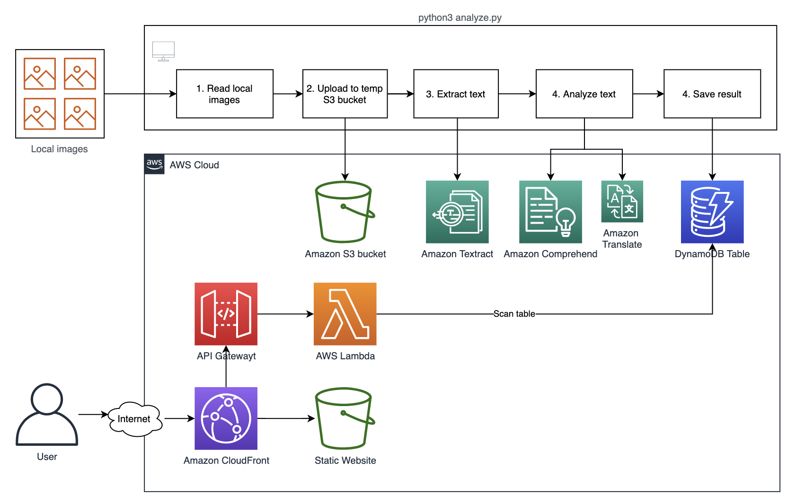
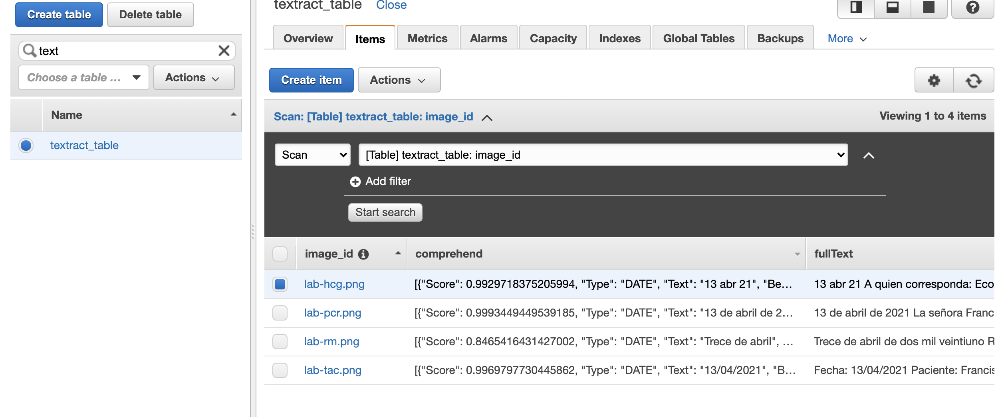
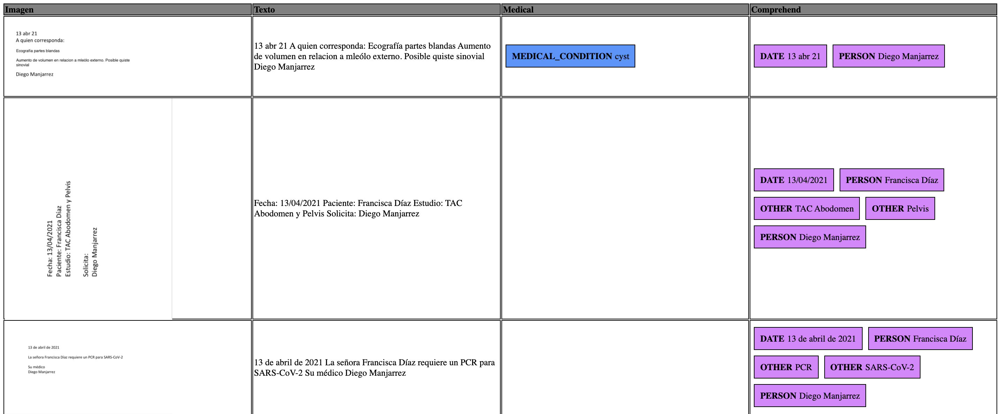

# Medical Images Analysis
It is a common requirement to automate healthcare processes by analyzing printed documents. These documents might include handwriten and printed text. [Amazon Textracts supports printed text for english and spanish and handwritten text for English.](https://aws.amazon.com/es/blogs/machine-learning/amazon-textract-recognizes-handwriting-and-adds-five-new-languages/)
This use case allows you to process a batch of medical images stored locally, detect the text, analyze it with Amazon Comprehend and Comprehend Medical, and then store the results on DynamoDB, so the results can be later reviewed on a website.

### Architecture


Steps: 
1. Create an Amazon S3 bucket with static web hosting
1. Create an Amazon CloudFront distribution and use the bucket above as the origin
1. Create a second Amazon S3 bucket for image upload
1. Create an Amazon DynamoDB table 
1. Create an AWS Lambda function
1. Create an AWS API Gateway and configure an integration with Lambda
1. Prepare the local script
1. Upload code to the static website

### 5. Create an AWS Lambda function
Use the sample code provided at [lambda.py](backend/lambda.py). Make sure to setup the variables:
* DYNAMODB_TABLE
* CLOUDFRONT_URL
* API_KEY: a unique key for authenticating your API

### 6. API Gateway
The recommended authentication method is to use an Amazon Cognito Identity Pool. Use this sample Lambda code with API_KEY authentication for testing purposes

### 7. Prepare and run the local script
Download the file [analyze.py](backend/analyze.py) and make sure to setup the variables:
* S3_BUCKET
* DYNAMODB_TABLE
* LOCAL_PATH_TO_IMAGES

Run the script using the following command. Make sure to setup local credentials first using [aws configure](https://boto3.amazonaws.com/v1/documentation/api/latest/guide/credentials.html)
```python
python analyze.py
```

Find some sample images with ficticious patient data at [backend/images](backend/images)

Open the DynamoDB table and you will find the Items created


### 8. Upload code to the static website
Download the [sample code](static/) and on the script.js setup the following variables:
* API_KEY: the same unique key specified on the Lambda code
* API_GW_ENDPOINT: enpoint for the api gateway

Upload the HTML and JS files to the root of the static bucket

### 9. Open the CloudFront URL and test the functionality


### Further reading
* https://aws.amazon.com/es/blogs/industries/how-to-process-medical-text-in-multiple-languages-using-amazon-translate-and-amazon-comprehend-medical/