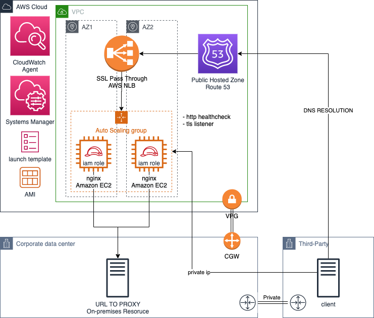
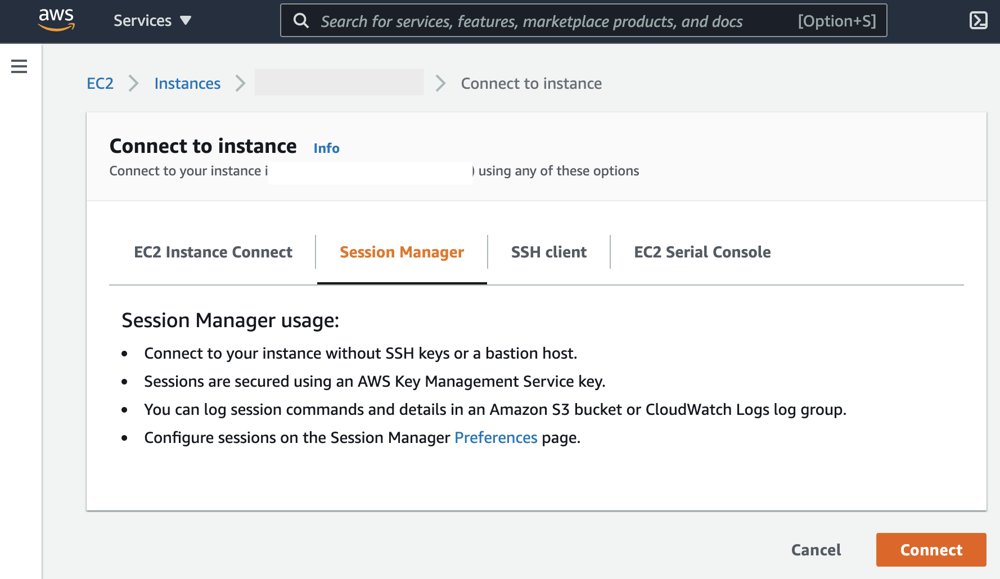
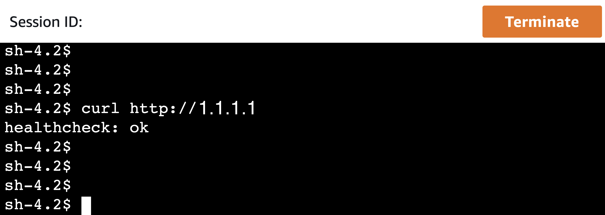
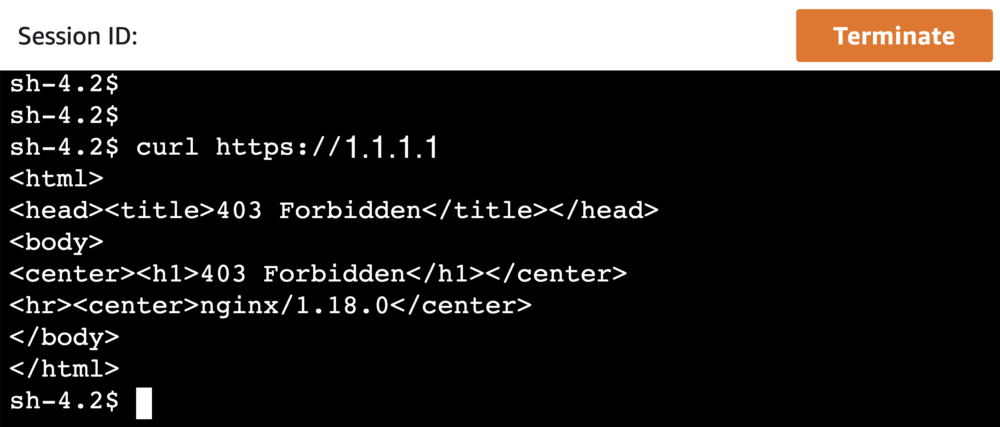
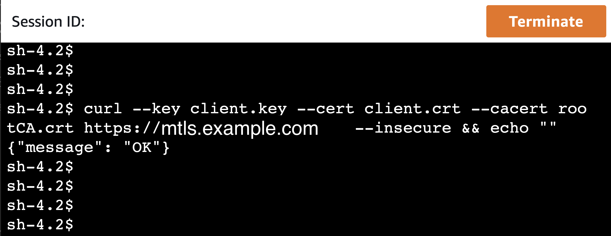

# Private API over mTLS

Mutual TLS (mTLS) is a common practice in business-to-business (B2B) applications, particularly within the financial industry.

TLS protocol requires a server to authenticate itself to the client, in mTLS, the server requests to the clients to use a certificate to prove its identity. 

AWS Api Gateway currently supports mTLS as indicated in this [blogpost](https://aws.amazon.com/es/blogs/compute/introducing-mutual-tls-authentication-for-amazon-api-gateway/), but is only available for public APIs.

Find bellow how to easily deploy a private API with a custom domain name and mutual TLS handled by NGINX, a web server that can also be used as a reverse proxy, load balancer, mail proxy and HTTP cache.

## Architecture


Steps:
1. Idenfity the URL of the resource you want to expose
1. Prepare your TLS certificates
1. Deploy the CloudFormation template
1. Test the setup

## 1. Idenfity the URL of the resource you want to expose

## 2. Prepare your TLS certificates
* Create an Amazon S3 bucket and upload your RootCA.crt, RootCA.key files, also, provide a client.crt for the client auth.
* If you don't have a TLS certificate, you can create one using openssl:
````bash
openssl genrsa -des3 -out rootCA.key 4096
openssl req -x509 -new -nodes -key rootCA.key -sha256 -days 1024 -out rootCA.crt
openssl genrsa -out client.key 2048
openssl req -new -key client.key -out client.csr
openssl x509 -req -in client.csr -CA rootCA.crt -CAkey rootCA.key -CAcreateserial -out client.crt -days 500 -sha256
````
* You can upload all your files to Amazon S3 using sync. Replace S3_BUCKET and S3_PREFIX with your own
````bash
aws s3 sync . s3://S3_BUCKET/S3_PREFIX/
````

## 3. Deploy the CloudFormation template
* Deploy the CloudFormation [template provided](template.yaml). This template uses a baseline Amazon Linux 2 to launch an Amazon EC2 instance and installs nginx. Then, it downloads from your bucket the required certificates and installs it by editing the sudo nano nginx.conf config file. You can check the configuration using:
````bash
sudo cat /etc/nginx/nginx.conf
````
Please configure your ngingx server appropiately, this is only a simple vanilla installation and it is not recommended for production. 

* You will notice that nginx is setup with proxy_pass, so the requests will be redirected to the URL especified in the CloudFormation parameter UrlToProxy. For convenience, this template also provides a sample mock API Gateway API and if you leave the UrlToProxy as -None- (default value) it will point your nginx server to the API endpoint. You can update the parameter later to apply your actual backend endpoint.

* The CloudFormation template will output both your mock API endpoint and your network load balancer DNS. Use this DNS to point a CNAME record for your domain name.

## 4. Test the setup
Connect to one of the servers tagged as "mtls" using the EC2 console, select the instance and then choose Connect (Session Manager)


You can send a test request to your nginx server using the private ip of the mtls server. (Include the --insecure flag if using a self-signed certificate)
````bash
curl http://1.1.1.1
````
This is how looks the response in a Systems Manager Session Manager web terminal. This is the response that we are using as healthcheck for the network load balancer, this port is not accesible from the load balancer.


Then, you can test the mTLS authentication, notice the 403 forbidden error:
````bash
curl https://1.1.1.1
````


Finally, make the request using the appropiate certificates with your own domain name:
````bash
curl --key client.key --cert client.crt --cacert rootCA.crt https://mtls.example.com
````



# Next Steps 
* Make sure to productionalize your nginx AMI
* It is recommended to create an AMI from the instances launched, so all the setup that is going behind the scenes using EC2 User data is not run at instance launch time
* After doing the previous step, remove the inline policy called s3-temporal-access from the mTLSInstanceRole, it's only necessary for initial setup (download the certificate files from Amazon S3)
* Integrate your own backend endpoint

# Go pro
* Setup Amazon CloudWatch agent to stream your nginx logs to CloudWatch as indicated in the [docs](https://docs.aws.amazon.com/AmazonCloudWatch/latest/monitoring/create-cloudwatch-agent-configuration-file-wizard.html)
* Enable NLB access logs following the [docs](https://docs.aws.amazon.com/elasticloadbalancing/latest/network/load-balancer-access-logs.html) so you can have full visibility of utilization of your endpoint
* Setup Amazon Athena to query your logs [docs](https://docs.aws.amazon.com/athena/latest/ug/networkloadbalancer-classic-logs.html)
* Setup an Autoscaling policy so your deployment can scale up and down as needed [docs](https://docs.aws.amazon.com/autoscaling/ec2/userguide/as-scaling-simple-step.html)