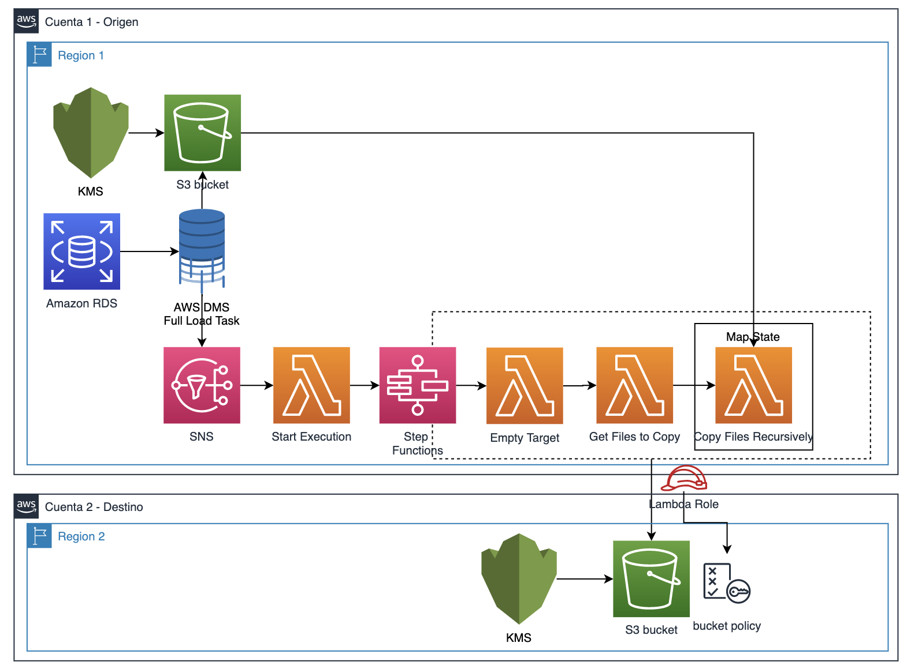
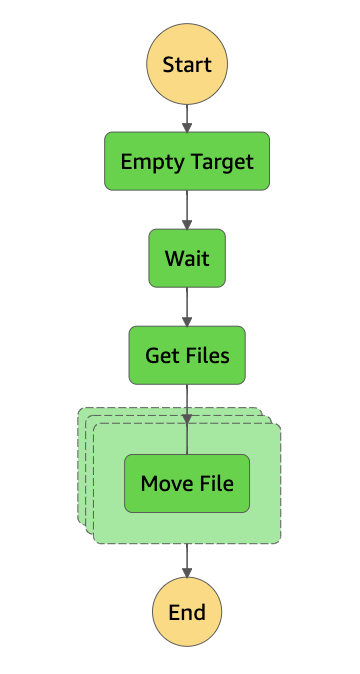

# Cross account, cross region DMS Full load task

1. Setup a DMS Full load task pointing to a local S3 bucket. 
* Under S3 target endpoint specify the endpoint settings:
````json
{
    "CompressionType": "GZIP",
    "DataFormat": "parquet",
    "AddColumnName": true,
}
````
* Setup DMS to drop target tables on S3
2. Create a State Machine
````json
{
  "Comment": "A Hello World example of the Amazon States Language using a Pass state",
  "StartAt": "Empty Target",
  "States": {
    "Empty Target": {
      "Type": "Task",
      "Resource": "arn:aws:states:::lambda:invoke",
      "ResultPath": "$.EmptyTarget",
      "Parameters": {
        "Payload": {
          "type": "emptytarget",
          "target_bucket.$": "$.target_bucket",
          "source_path.$": "$.source_path"
        },
        "FunctionName": "arn:aws:lambda:us-east-1:<<ACCOUNT_ID>>:function:<<FUNCTION_NAME>>:$LATEST"
      },
      "Next": "Wait"
    },
    "Wait": {
      "Type": "Wait",
      "Seconds": 29,
      "Next": "Get Files"
    },
    "Get Files": {
      "Type": "Task",
      "Resource": "arn:aws:states:::lambda:invoke",
      "Parameters": {
        "FunctionName": "arn:aws:lambda:us-east-1:<<ACCOUNT_ID>>:function:<<FUNCTION_NAME>>:$LATEST",
        "Payload": {
          "type": "initialize",
          "source_bucket.$": "$.source_bucket",
          "source_path.$": "$.source_path"
        }
      },
      "Next": "Iterate Files",
      "ResultPath": "$.files"
    },
    "Iterate Files": {
      "Type": "Map",
      "End": true,
      "Parameters": {
        "type": "copy",
        "source_bucket.$": "$.source_bucket",
        "target_bucket.$": "$.target_bucket",
        "file.$": "$$.Map.Item.Value"
      },
      "Iterator": {
        "StartAt": "Move File",
        "States": {
          "Move File": {
            "Type": "Task",
            "Resource": "arn:aws:lambda:us-east-1:<<ACCOUNT_ID>>:function:<<FUNCTION_NAME>>",
            "OutputPath": "$.Payload",
            "End": true
          }
        }
      },
      "MaxConcurrency": 100,
      "ItemsPath": "$.files.Payload"
    }
  }
}
````
2. Create a Lambda function
````python
import json
import boto3
import time
from datetime import datetime

s3 = boto3.client('s3')
stepfunctions = boto3.client('stepfunctions')
STEP_FUNCTIONS_ARN = 'arn:aws:states:us-east-1:<<ACCOUNT_ID>>:stateMachine:<<STATE_MACHINE_NAME>>'
S3_SOURCE_BUCKET = '<<SOURCE_BUCKET_NAME>>'
S3_TARGET_BUCKET = '<<TARGET_BUCKET_NAME>>'
S3_SOURCE_PATH = '<<SOURCE_S3_PATH>>'

#Max 1000 files on source and target
def lambda_handler(event, context):
    if(event.get('type') == "initialize"):
        objects = s3.list_objects(Bucket=event.get('source_bucket'),Prefix=event.get('source_path'))
        keys = []
        for obj in objects['Contents']:
            if(obj['Key'] != event.get('source_path')+"/"):
                keys.append(obj['Key'])
        return keys
    elif(event.get('type') == "emptytarget"):
        objects = s3.list_objects(Bucket=event.get('target_bucket'),Prefix=event.get('source_path'))
        if(len(objects.get('Contents',[])) > 0):
            keys = []
            for obj in objects['Contents']:
                if(obj['Key'] != event.get('target_bucket')+"/"):
                    keys.append({"Key": obj['Key']})
            delete = s3.delete_objects(Bucket=event.get('target_bucket'),Delete={'Objects': keys},)
            return {"Status": "deleted"}
        else:
            return {"Status": "no files to delete"}
    elif(event.get('type') == "copy"):
        copy = s3.copy_object(CopySource={"Bucket":event.get('source_bucket'), "Key":event.get('file')},
            ACL='bucket-owner-full-control',Bucket=event.get('target_bucket'),Key=event.get('file'))
        time.sleep(15)
        repeat = 3
        while True:
            repeat=repeat-1
            try:
                exists = s3.head_object(Bucket=event.get('target_bucket'),Key=event.get('file'))
                break
            except:
                print('file not ready')
                time.sleep(15)
                if(repeat==0):
                    raise Exception('Copy error: {}'.format(event.get('file')))
        delete = s3.delete_object(Bucket=event.get('source_bucket'),Key=event.get('file'))
        return {"Payload": "ok"}
    elif(len(event.get('Records',[])) > 0):
        if(event.get('Records')[0]['Sns']['Message'].find('DMS-EVENT-0079') != -1):
            print("SNS")
            print(event)
            today = datetime.now()
            execs = stepfunctions.list_executions(stateMachineArn=STEP_FUNCTIONS_ARN,statusFilter='RUNNING')
            if(len(execs['executions']) == 0):
                response = stepfunctions.start_execution(
                    stateMachineArn=STEP_FUNCTIONS_ARN,
                    name=S3_SOURCE_BUCKET+"-"+today.strftime("%Y.%m.%d-%H.%M.%S"),
                    input="{\"source_bucket\": \""+ S3_SOURCE_BUCKET + "\",\"target_bucket\": \""+ S3_TARGET_BUCKET + "\",\"source_path\": \""+ S3_SOURCE_PATH + "\"}"
                )
                return {"Status": "Execution Started"}
            return {"Status":"Already in progress"}
        return {"Status": "Not of interest"}
````
3. Configure cross account permissions as per [the docs](https://aws.amazon.com/es/premiumsupport/knowledge-center/lambda-execution-role-s3-bucket/)
4. Setup event notifications for DMS full load task as [per the docs](https://docs.aws.amazon.com/dms/latest/userguide/CHAP_Events.html). Filter the events by **replication task** and **state changes** only
5. Replace tags marked with <<>> in Lambda function and State Machine. 
6. Setup proper permissions for Lambda function and State Machine
7. Restart DMS full task, after finishing, a the state machine execution should start and files should be moved to the cross account, cross region bucket.
